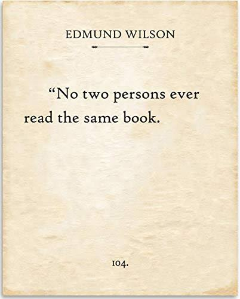

# OpenCV-OCR
OpenCV OCR (Optical Character Recognition)

## Python OpenCV Optical Character Recognition with Webcam.

## Installation:

```

pip install opencv-python
pip install random
pip install json
pip install requests

```

### Input


## Results in "text_detected.txt"


## Usage:

```
python3 main.py

```




Show the picture to the Camera and Just Wait.
Pictures saved in 'data' folder and texts saved in "text_detected.txt".
